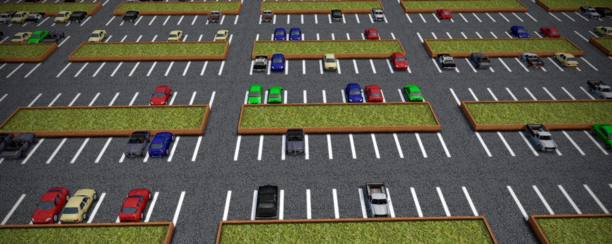

# About Sceelix

Sceelix is a standalone, [procedural generation](https://en.wikipedia.org/wiki/Procedural_generation) software for automating 2D/3D content creation using algorithms, rules, and mathematical models.

Procedural generation has been around for many years, and its popularity has risen in the latest years with release of titles such as [Spore](https://en.wikipedia.org/wiki/Spore_(2008_video_game)), [Minecraft](https://en.wikipedia.org/wiki/Minecraft), [No Man's Sky](https://en.wikipedia.org/wiki/No_Man%27s_Sky), to name a few. In film/tv production, the [Lord of The Rings films](https://en.wikipedia.org/wiki/The_Lord_of_the_Rings_(film_series)), [300](https://en.wikipedia.org/wiki/300_(film)) or [Game of Thrones](https://en.wikipedia.org/wiki/Game_of_Thrones) are known examples that use procedural techniques in their workflows.

The goal of Sceelix is to make such procedural generation technologies more mainstream and accessible to everyone.

## One system to rule them all

Sceelix is certainly not alone in the procedural generation market. There are many mature tools around for creating terrains (e.g. [World Machine](https://www.world-machine.com/), [World Machine](https://www.world-creator.com/)), cities ([CityEngine](https://www.esri.com/en-us/arcgis/products/arcgis-cityengine/overview), [SceneCity](https://www.cgchan.com/)), vegetation (e.g. [SpeedTree](https://store.speedtree.com/), [Terragen](https://planetside.co.uk/)), materials (e.g. [Substance](https://www.substance3d.com/)), special effects (e.g. [Houdini](https://www.sidefx.com/)), voxels (e.g.[VoxelFarm](https://www.voxelfarm.com/index.html)), dungeons (e.g. [Deadalus](https://troglobytes.itch.io/daedalus)) and many more.

The specialization of the existing tools also means that one can't usually fully create a complete virtual world at once. Since these tools can only cooperate through export formats, there is always some manual labour involved to put them together in the end. Depending on the scale, this implies overheads and integration difficulties in the creation workflows.

By comparison, Sceelix does not focus on a single type of content type or structure. While Sceelix is still a work in progress in many areas, it can be used to produce terrains, vegetation, roads, cities, props, game objects and many more. This makes the content generation process much simpler, fluid, efficient and complete.

## A system focused on the data

At the core of Sceelix lies its node-base language to create connected graphs. Such visual languages have become popular in many systems, from geometry modeling (e.g. [Houdini](https://www.sidefx.com/), [Grasshopper](https://www.grasshopper3d.com/)) to shading tools (e.g. [Amplify Shader Editor](https://amplify.pt/unity/amplify-shader-editor/), [NodeFlex](http://www.shaderplay.com/products/nodeflex/overview/overview.html)) or even game engines (e.g. [Unreal](https://docs.unrealengine.com/en-US/ProgrammingAndScripting/Blueprints/index.html), [Unity](https://unity.com/products/unity-visual-scripting)), among others.

The nature of Sceelix's node-base language is unique in the sense that it focuses on high-level operations (such as creation, loading, modification and export) that encapsulate a lot of complexity (such as best fit algorithms, constraint-based programming or growth simulations) that is more easily implemented using the underlying programming language, C#. Small mathematical expressions (such as adding, multiplying or using trigonometric functions) are performed on the node parameters themselves, instead of cluttering the graphs with small operations. Together with features such as encapsulation (the ability to reuse full graphs as nodes inside other graphs), this visual language gets easier to navigate, understand and manage.

## A system for both design-time and run-time

One of the appeals of procedural generation, particularly in games and simulations, is the ability to create new content on-the-fly. Either by occurring at load-time, before the level starts, or in run-time as the player moves around and takes different actions, it increases replayability since it offers dynamic experiences that differ from the limited set of those created and bundled in advance by the design team.

Many procedural tools focus on design-time generation of content to produce large, detailed environments, that are then shipped with the application. However, if the goal is to provide new content on-the-fly, these tools don't cut it - the generation process needs to occur dynamic within the application based on previously defined design rules.

Sceelix answers both needs - design and runtime generation - through the Sceelix procedural `Engine`: a set of code libraries that contain the necessary logic to call and execute procedural generation processes. These can be integrated and called from any application - including games and simulations - to execute procedural generation in runtime and return new content based on varying parameters. The Sceelix `Designer` is a tool built on top of these libraries and allows a design-time interface to assemble procedural generation workflows through the aforementioned visual language. The designed visual graphs can then be used in both design-time or shipped with the application and executed in load-time or run-time.

## A system integrating the best of all worlds

There's this common thinking that adopting procedural generation means abandoning manual content creation altogether.

The reality is that procedural generation can be employed at different degrees, according to the intended goal and available resources. You may opt to generate a terrain and roads procedurally, but choose to place manually created props on top of it. Or create spaceship models procedurally, but to use textures from a static set for its materials. Or use an manually created image as a source that drives the procedural positioning of vegetation.

Sceelix provides means for loading and manipulating static assets at any point of the pipeline. This gives you the freedom to use procedural methods where it makes more sense for your project.

## An extensible system

Almost everything in Sceelix has been developed with [extensibility in mind](../SDK/Introduction), so that new features could be introduced without having the need to access and change the original source code.

Sceelix has been developed in C# using the .NET Framework/Mono and is organized into modules/assemblies that are dynamically loaded on startup. Anyone can develop new such modules and have them being loaded by just placing them in the plugins folder. Such modules can contain extensions to the Sceelix Engine or the Sceelix Designer, such as:
- For the Sceelix Engine: new types of content, procedures/nodes or mathematical functions.
- For the Sceelix Designer: new windows, controls, file format handlers, content viewers and initialization calls.

## A connected system

When procedural tools export their generated data to common formats (e.g. .fbx, .obj, .jpg, .svg), there is a lot of information that gets lost. In a game development scenario, for example, you might want to procedurally create a 3D model of a village featuring fences, doors, windows and lamp posts. At this point, once could also generate behavioral and semantic information, such as the wall collision information, door opening directions, light properties and ambient sound triggers. Unfortunately, no standard format exists to carry this data between systems.

Sceelix addresses this issue in the following ways:
- First, by allowing anyone to introduce new procedures/nodes, it is possible to create custom exporters that carry this information over (e.g. to json, xml or yaml files), which can then be read on the target platform (using a custom importer, if supported). Second,
- Second, through direct connection to the target systems. A first integration already exists with the [Unity Game Engine](../Unity/Introduction), by having the Sceelix Designer communicate directly with the Unity Editor through a socket connection. This not makes the workflow between the tools much faster, but also allows passing of semantic and behavioral information that can instruct

