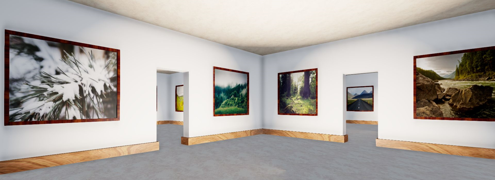

### What is Sceelix?
Sceelix is a software for automating 2D/3D content creation using algorithms, rules, and mathematical models, a practice called procedural generation.

### How much does Sceelix cost?
Nothing! Sceelix is now free and open-source.

### What Platforms can Sceelix run on?
Sceelix is available for Windows, Mac and Linux.

### Is Sceelix a Game Engine like Unity or Unreal Engine?
No. Sceelix is a tool for producing 2D/3D content, which can (among other things) be used in game development. Think of it as something closer to software like Blender, Sketchup, Inkscape or even Paint.

### Can Sceelix be used in Commercial Applications?
Absolutely.

### Is Sceelix still being developed?
Yes, it is.

### Sceelix is not working on my computer! What is wrong?
Please check the documentation section on [Logging and Troubleshooting](../Setting%20Up/Logging) to get a better understanding of what the problem might be. Make sure you have the [necessary dependencies](../Setting%20Up/Installation) installed, such as .NET Framework 4.6.1 or above (for Windows) and Mono 6 or above (for Mac and Linux). If everything else fails, you can should check the [discussions](https://github.com/Sceelix/Sceelix/discussions) for possible solutions or post a new question yourself.