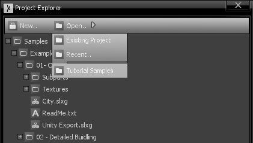

Exploring the Samples
=====================

In the Project Explorer window, you can either choose to start a new project or load an existing one. Sceelix always ships with a sample tutorial project. It is unpacked and opened by default on Sceelix’s first run and subsequent version updates will ask if the user wishes to load the samples for that version.

In addition, the samples folder can be loaded any point by choosing the option Open -> Tutorial Samples in the Project Explorer Window menu, as shown in the following image:

## Samples Content

The sample project is structured as follows:

* **Demos:** This is a compilation and showcase of several examples of scenes that can be created using Sceelix. Each subfolder focuses on a different type of content or scene and encompasses several graphs and resources. The main graphs to look at kept directly below each subfolder level. Each folder contains a Readme file that provides some insight on what is being done in each example.
* **Learning Concepts:** Before going deeper into how the examples work, you should start by going through these tutorials, which will provide quick but effective, hands-on understanding of Sceelix’s graph concepts. From adding nodes and edges to manipulating attributes and encapsulating graphs, all will be explained.
* **Examples:** Understanding how to use graphs is one thing, but accomplishing certain tasks is another. This contains several short practical examples on how to use certain nodes, entities and other features in Sceelix.
* **Utils:** A couple of graphs that are reused throughout all examples and tutorials.

This sample folder will be updated with new resources on every release, so do check them out!