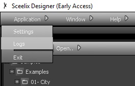
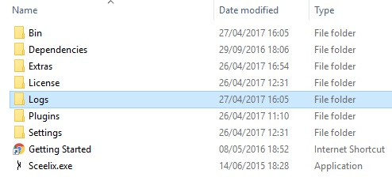

Logging and Troubleshooting
=====================

If you run into some issues with Sceelix (for example, the application not running, crashing, throwing errors), the first step to find the solution is to check the application logs.

The Sceelix Designer application has a direct link to the folder. At the top menu, choose Application -> Logs and you will be taken straight to the folder containing the logs.



## Alternative Search

If you can’t start Sceelix at all, you’ll have to have to search for the logs “manually”. This differs from platform to platform.

#### Windows (Portable)

The portable versions are the easiest ones. You can find the logs in the folder where you’ve unpacked Sceelix, as shown in the image.



#### Windows (Installed version, including Steam version)

The installed Windows versions follow the same pattern as many other applications by storing configuration files in the AppData folder.

One easy way to go straight to that folder is by running the command “appdata” from the Run window, as explained [here](https://www.windows-commandline.com/open-appdata-folder-from-run-window/).


Once inside the AppData folder, you can find the Sceelix logs under **Roaming\Sceelix\Logs**. 

#### MacOS  (Standard and Steam versions)

You can find the log folder in the default MacOS **.config** folder, under a folder named **Sceelix**.

You take take a shortcut by opening a terminal window and typing in:
```
open ~/.config/Sceelix
```
This will open a Finder window showing the logs.

#### Linux  (Standard and Steam versions)

As in MacOS, the the log folder can be found in the default **.config** folder, under a folder named **Sceelix**.

You take take a shortcut by opening a terminal window and typing in:
```
cd ~/.config/Sceelix
```
to get you straight to the log folder. If you use Nautilus, for instance, as the file manager, you can just type in:
```
nautilus ~/.config/Sceelix
```
which will open the folder with the logs in the file manager.


## Analysing the Logs

Once inside the log folder, you might find several files, named after the day that they were issued. You should look for the most recent file and open with your default text editor. You can find the most recent entries at the bottom of the file. There, you’ll probably find information about your error.

If you are unsure of the reason of the problem or would like to report it, you can do so in the [technical issues section of the discussions page](https://github.com/Sceelix/Sceelix/discussions/categories/ideas).


## Log Options

Sceelix creates a log file for each day that it runs, up to (a default of) 10 days. After that, the logs for the days before will be removed and replaced with the most recent ones. You can change this configuration in the Sceelix Settings. At the top menu, choose **Application->Settings** and you’ll find the option under the “Designer” section.

