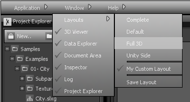

# Interface, Layouts and Settings

Sceelix is a highly modular system, whereas each module (or plugin) contains a set of windows, each containing specific features.

The type of windows available at this point are:

* **[Project Window](ProjectExplorer):** Here is where you can create, load and navigate through resources, which are organized in the form of folders and files.
* **[Document Window](DocumentArea):** When you double-click a project resource (images, graphs, text files…), this is where the content will be displayed.
* **[3D Viewer](3DViewer):** This is where the generated 3D objects will be displayed when you execute a graph.
* **[Inspector](Inspector):** When you click on graph nodes or 3D objects, their properties will be shown in the window, allowing you to change them.
* **[Log](LogViewer):** Error, Warning and Informative messages are listed here.
* **[Data Explorer](DataExplorer):** Lists all the data that were generated through graphs.

More details about the purpose and functioning of each window are described in further sections.

## Layouts

You are free to move and resize the existing windows by dragging them with the left mouse button. You can also open/close them and check for other available windows via the top menu -> Window option. Finally, you can load existing window layouts (via top menu ->Window->Layouts) and save your custom layout (via top menu ->Window->Layouts -> Save Layout), which allow you to switch between different window configurations easily.

## Settings

Most configurable options are accessible in the top menu, via “Application->Settings”. Settings are usually organized per category/module/window and changes only take effect after pressing OK. Hovering each property will show a corresponding description of their function.

