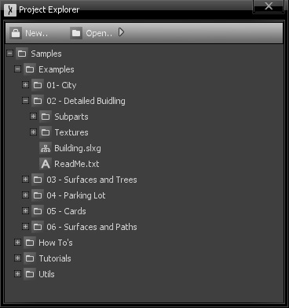
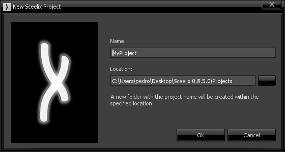

# Project Explorer

Like many 3D environments, Sceelix’s workflow revolves around the manipulation of resources organized into **projects**. Such organization allows for easy and consistent manipulation of files, which may relate and reference one another. Examples of supported resources are images, 3D models or graph files.

Projects are structured into files and folders in a recursive way, like any file system does. These are displayed together in the same tree-like fashion, simply featuring different icons for easy visual differentiation.



It is important to note that the resources listed in the project may not reflect the full contents of the underlying file system contents. In other words, the files and folders of the project DO exist in the file system, but there might be other files in the same location that are NOT part of the project. Moving or copying a file through the operating system to the project folder will NOT add that file to the project. It has to be done inside Sceelix, as shown below.


## Creating Projects

In order to create a new project, you should use the window top menu (not the Sceelix main menu) and click “New…”. This will open the “New Sceelix Project” window.



As indicated, having indicated a project name and location, a new folder with the project name will be created within the location. In the example above, this would create a folder named
```
C:\Users\pedro\Desktop\Sceelix 0.8.5.0\Projects\MyProject
```
and inside, a file called MyProject.slxp. This file contains an index of the items that belong to the project. All Sceelix project files have the .slxp extension.


## Opening Projects

Opening an existing project is also achieved via the Project Explorer top menu, by clicking the “Open..” menu that features the following options:

* **Existing Project:** This opens a dialog window which will allow you to search your file system for .slxp files and open them.
* **Recent..:** Shows the list of the last loaded projects, allowing you to toggle between different projects rapidly.
* **Tutorial Samples:** Extracts and opens the [sample project](../Setting%20Up/ExploringSamples) for the current Sceelix version.


## Managing Resources

Once a project has been created and/or opened, you can create new files or copy existing ones. You can do so by right-clicking a folder, which will open its context menu, as shown in the image below:


The available options are as follows:

* **Add:** Allows for files or folders to be added or created inside this folder.
    * **New Item:** Allows the creation of a new file from one of the available formats supported by Sceelix.
    * **Existing Item:** Allows one more more files to be selected from the file system and brought into the project. The files will be copied and listed as project resources.
    * **New Folder:** Allows the creation of a new folder.
    * **Existing Folder and Contents:** Allows a full folder tree (including all subfiles and subfolders) to be imported at once.
* **Open in Explorer:** Shows the contents of the selected folder in the file explorer of the Operating System.
* **Copy Path:** Copies the full path of the folder to the clipboard.
* **Rename:** Renames the folder.
* **Exclude:** Removes the folder and its subitems from the project, but leaves them in the disk.
* **Delete:** Deletes the selected folder from the project and from the disk.

On the other hand, right-clicking a file brings up a context menu with the following options:

* **Open:** Opens the file editor or viewer in the [Document Area](DocumentArea), if applicable.
* **Open Folder in Explorer:** Shows the contents of this file’s parent folder in the file explorer of the Operating System.
* **Copy Path:** Copies the full path of the file to the clipboard.
* **Rename:** Renames the file.
* **Duplicate:** Duplicates the file and its contents and adds it inside the same folder.
* **Exclude:** Removes the file from the project, but leaves it in the disk.
* **Delete:** Deletes the selected file from the project and from the disk.