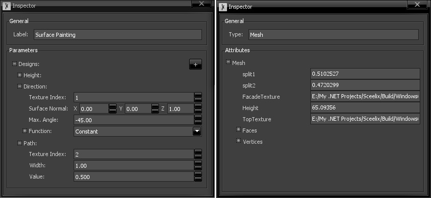

# Inspector

The inspector is the window where object properties can be viewed and/or changed – in other words, inspected. By default, the contents of this window are empty, but change according to requests of other windows. Such changes usually happens when an item is selected or deselected.

The graph editor, for instance, shows the properties of the selected graphs, nodes or ports. The 3D Viewer or Data Explorer show the properties of their selected items. The exact style, format and content that is displayed depends on the context and type of object being inspected.