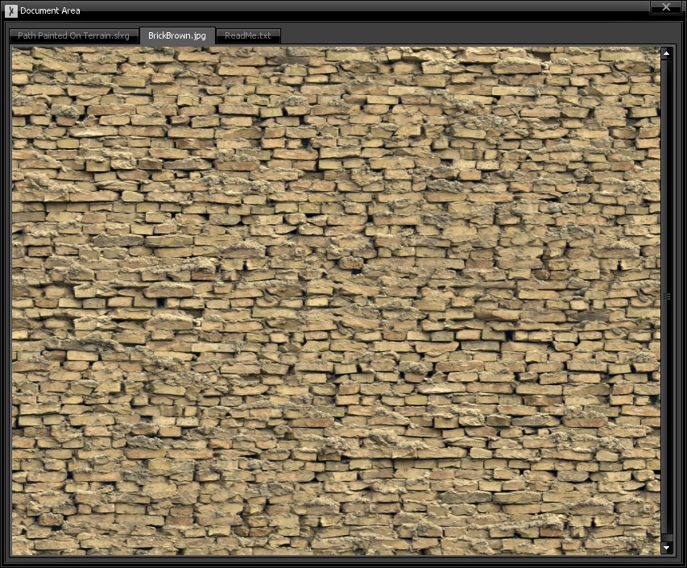

# Document Area

The document area works essentially together with the Project Explorer. When file are selected and double-clicked in the project explorer, their contents appear in the Document Area window. Depending on the file type, the contents can be only viewed (which is the case for [image files](ImageViewer)) or can actually be edited (like [text](TextEditor) files or [graph files](GraphEditor)). As this moment, there are few supported file editors/viewers, but more can and will be added in the future.

Each file content is displayed as a tab in the document area. You can right-click a tab to see their context menu, which will allow you to close the tab, all the tabs, or all except the selected one.

Typically, when the content of a file editor is changed, its respective tab label will be shown with an asterisk. This indicates that there are pending changes to be saved to disk. Attempting to close the tab will trigger a warning dialog, offering the chance to save the file for you.