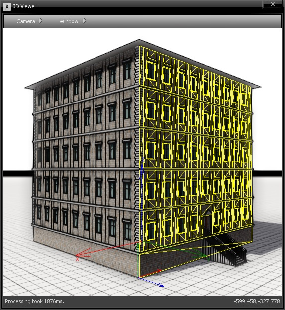
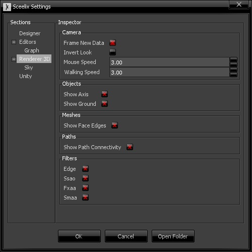

The 3D viewer is one of the possible viewers of data generated by graphs. By design, the purpose of the 3D Viewer is to display data that have a physical/visual representation in 3D space. This is the case for all kinds of Actors, such as Meshes, Surfaces, Paths, etc.

## Navigation Controls

The 3D Viewer controls follows a similar style of Unity3D:

* **Left-Mouse click:** Selection of objects in the scene.
* **Middle-Mouse button or Left + Shift while moving mouse:** Camera panning.
* **Mouse Scroll wheel:**  Camera zoom in and out.
* **F:** zoom on an object selection or on the full scene (if nothing is selected).
* **WASD keys:**  Moves camera position, like a first person shooter.
* **Space:** Moves camera position in the upwards direction.
* **C:** Moves camera position in the downwards direction.
* **While pressing the Right-Mouse button:**
  * **Move mouse:** Moves camera view target, like a first person shooter.
* **Move mouse vertically + Alt key pressed:** Zooms in and out.
  * **While pressing the Left-Mouse button:**
  * **Move Mouse + Alt key pressed:** Rotation around the last focused object/target.

## Options

The window top menu features the following options:

* **Camera**
  * **Frame:** Zooms and frames the camera view to the currently selected item or to the whole scene, if none is selected (same as pressing F).
  * **Reset:** Resets the camera view to the origin.
  * **Take Screenshot:** Takes a higher resolution printscreen of the currently displayed view and saves it to the Desktop.
* **Window**
  * **Clear:** Removes the content currently being displayed.
  * **Preferences:** Opens the Sceelix Settings Window, focusing on the section that concerns the 3D Viewer.

## Settings

