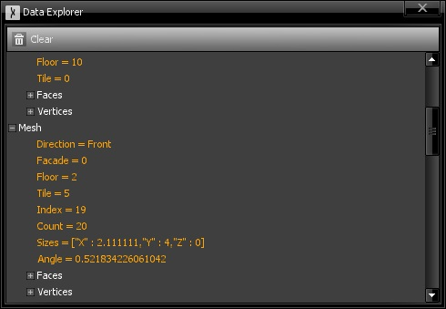

# Data Explorer

The data explorer is the most generic viewer for information generated through graphs. Its purpose is to display all entities that have been produced in the last execution.

The entities are displayed in a hierarchy, with the main entities at the base level and their subentities as subitems. The attributes of each entity are also displayed, but in an orange color.

The base entity items can be selected, so as to view more details in the [inspector window](Inspector). If the 3D Viewer is open and the selected entity has a visual representation, it will be highlighted. In addition, double-clicking the item will trigger a camera zoom to the entity.