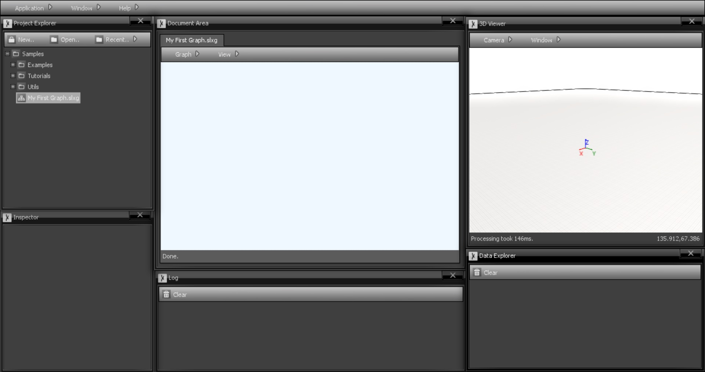

# Getting Started

This series of short tutorials will explain the basics of Sceelix’s graph-based language. While apparently simple, Sceelix graphs are very powerful once all its concepts are grasped. Note that you can find more practical versions of these tutorials in the [sample project](../Setting%20Up/ExploringSamples) shipped with every Sceelix version.

Graph files can be created and accessed via the Project Explorer. When double-clicked, they are shown in the [Document Area](../Working%20With%20Sceelix/DocumentArea), as in the following figure:

In order to create new graphs, right-click a folder and choose Add-> New Item. In the window that appears, you can choose “Graph” as the type of file to create. The newly created graph will be immediately shown on the Document Area where you can start working on.

 

