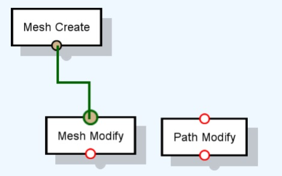

# Graph Basics

Graphs are made of `nodes`, which represent operations that create, analyse, transform, import, export or otherwise do something with data. `Edges` establish connections between the nodes, indicating how the data flows from one node to the other. Edges connect the nodes through the available node `ports`, as long as they are of compatible data types. Nodes can have input ports (located on the upper area of a node) that are used to receive data. They can also have output ports (located on the bottom area of a node) that are used to return data processed by the node.

## Adding Nodes

Right-click anywhere in the blue canvas and, in the context menu that appears, choose “Add Node”. This will open a list of available nodes that you can use. You can type in the node that you are looking for to filter the list, navigate the list using the ‘Up Arrow’ and ‘Down Arrow’ keys and press ‘Enter’ (or mouse double-click it) to add it to the graph .

## Connecting Port Nodes with Edges

Once you have a couple of nodes in your graph, you can connect them by dragging edges between their ports. Click and hold the left mouse button on one port and release it on the other port.

When hovering a port or dragging an edge, all other node ports are highlighted, indicating if a connection can be made with that port. Green indicates that the connection is possible, red indicates that it is not. Orange indicates that the connection should possible, but cannot be confirmed by the system. This is due to the fact that there are node that are able to handle more generic types and other are more specific. This topic is tackled further ahead.

Notice that, in the figure above, the output ports of the extrude node are red, because it is not possible to connect an output port to another output port. The input port of the ‘Path Modify’ is also not a possibility, since the data types are different.

The color of the edge will also change to indicate if a given connection is possible or not, according to the same principles.

## Navigating the Graph

The controls for navigating and controlling the view of the graph are the following:

* **Left-Mouse click:** Selection of nodes, edges, ports and presentation of graph properties.
* **Right-Mouse click:** Context menu for graph and selection.
* **Middle-Mouse press or Left + Shift while moving mouse:** Camera panning.
* **Mouse Scroll Wheel:**  Camera zoom in and out.
* **F:** zoom on a node selection or on the full graph (if nothing is selected).
* **Alt+Left Mouse click:** When pressed on edges and ports, toggles between states (enabled, disabled, etc.)

## Executing the Graph

Finally, you can execute your graph by choosing “Execute” in the context menu or double-clicking anywhere in the blue area. The result appears in any window that is programmed to show the type of data your have just generated.

For 3D data, the result will appear under the [3D Viewer](../Working%20With%20Sceelix/3DViewer) (or Data Explorer or any other window meant for data exploration). If nothing shows up, the result may be simply out of view. On the 3D Viewer’s top menu, select Camera->Frame to zoom on the generated result. You can find details on navigation controls in this section.

