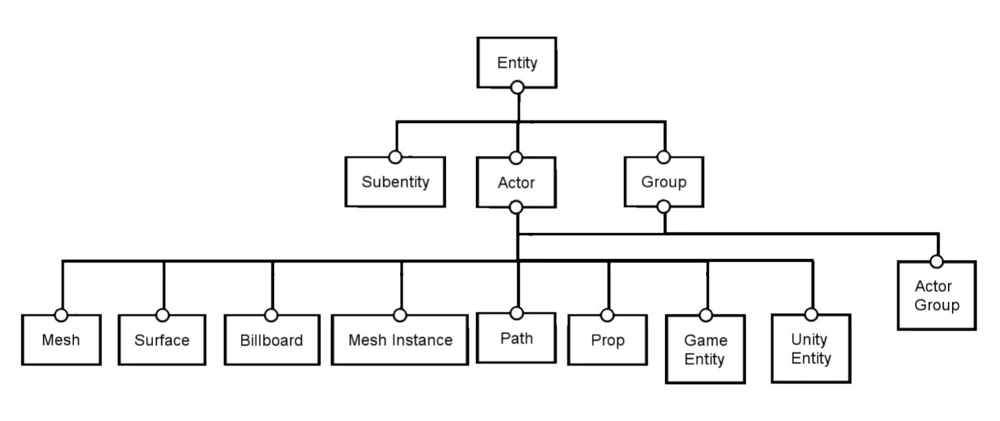

# Entities

The data that flows between nodes is organized in the form of objects called `entities`.

Entities are meant to represent independent and self-contained objects, carrying their own, specific semantics and used for specific purposes. They are the content that you want to generate, e.g. `Meshes`, `Surfaces`, `Game Objects`.

Each entity has its own specific data model, which aggregate the necessary properties in the most adequate and optimal structure. In other words, the difference between entities help us create and manipulate data in the easiest and most efficient way through the nodes.

## Hierarchy

The many entity types are organized in a hierarchy. This means that an entity of type `Mesh` (a derived type) is also considered to be an `Actor` (both a base and derived type), and, in turn, both are considered to be of type `Entity` (the base type). This is useful, because it allows nodes that handle entities of a base type to accept entities of a derived type. For instance, the node `Copy`, which copies entities of type `Entity`, is capable of copying any kind of entity. If you did not have this possibility, you would need to have different nodes to copy `Meshes`, other to copy `Paths`, and other to copy `Game Entities`, for instance.

Entities can also enclose other entities. For instance, a `Group Entity` can store other entities inside it, which is useful to organize data and carry it around. Another example is the `Mesh` that has subentities, like `Faces`, `Vertices` and `Edges`.

## Available Types

At this moment, Sceelix provides the following entity types:

* **Entity:** The base type of all entities. Although it does not have a visual representation, it is useful to carry attributes (link) and trigger impulse ports.
* **Group:** Groups any kind of entities. Useful to organize entities.
* **Actor:** The base type of all 3D entities. It can be translated, rotated and scaled in 3D space.
* **Actor Group:** Groups any kind of actors. Useful to organize actors and perform transformations on whole sets of 3D entities.
* **SubEntity:** Entities that are, in fact, inside of other entities (e.g. Mesh faces, Path vertices).
* **Mesh:** Set of polygonal faces, connected by vertices. The main entity to where standard 3D modeling is performed.
* **Mesh Instance:** A reference to a mesh, but that has a distinct translation, rotation or scale. Used to create multiple copies of the same 3d model, in a way that is more CPU and GPU efficient to handle.
* **Surface:** A grid-based polygonal mesh, optimized for terrain generation and 2D layer sampling.
* **Billboard:** An image with a 3D positioning which always faces the camera. Useful for creating grass, trees and other objects at distances where geometric detail is not important, but a sheer number of instances is.
* **Path:** Line-based entity, connected by vertices. Used to describe ways, paths, roads, etc. before they are transformed into meshes.
* **Unity Entity:** A component-based entity with properties and behaviors for use inside Unity-based games. When created in the Sceelix Designer, they are automatically sent to a connected [Unity Editor](../Unity/Introduction).
* **Prop:** An entity that has a visual representation, useful to set up an environment in the Sceelix Designer only (like an Ocean plane or Fire effect).