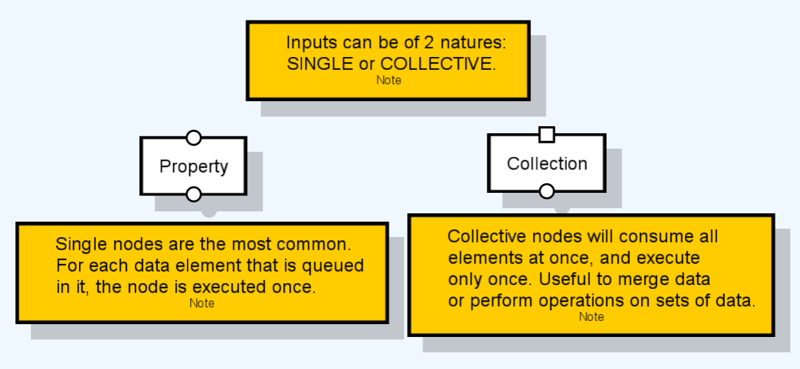

# Ports

This section will provide some more details about node ports and how they handle entity data.

Input and output ports are the way for nodes to pass data between each other. Most nodes receive entities in their inputs to analyse, modify, or transform them, returning them through their output ports.

## Data Dependency

In order for a node to execute, it needs to have entity data in all its inputs. Only then can it process all the incoming entities and produce a result.

Because of this logic, the nodes that have no input ports are the first to be executed. These are called `source` nodes and are executed only once (per graph execution). This is because they are the ones that create or load data in the first place.

## Type Compatibility

Ports can only be connected by and edge of they are of compatible entity types. In this sense, it is important to understand well the relationships between the several input types.

You can connect an output of a derived type (for instance, `Mesh`) to an input of a base type (for instance, `Entity`). You cannot, however, connect an input of unrelated types (for instance, `Mesh` and `Surface`) since a conversion is not implicitly available (you may have nodes that explicitly convert from one to another, though). You can connect from base type output to a derived type input, but verifying this can only occur when executing the graph – this is why both ports and edges will turn orange if you attempt to do this connection.

## Inputs Natures

When entities arrive at an input port, they are queued, until it is that node’s turn to execute. At that point, the node will execute several rounds sequentially as many times as needed until one of the input ports is depleted.

The nature of inputs can be classified in the way that they handle their input entities: `Single` or `Collective`.

* The single input port is the most common. It takes one entity from its queue at the time to be executed at that round. It is represented by a circle shape.
* The collective input port will take all entities from its queue at once to be executed in a single round. It is represented by a square shape.

The reason for this difference is that, since data is actually made of individual entities, some nodes need to take all entities as a whole, while other can process individual data items. For instance, a node that merges several meshes into one needs to take them all at once, after which it will output the merged mesh. However, a node that copies meshes will only take one mesh at the time, copy it, output it and then pass on to the next in line. These are effectively different cases and different processes and both are supported by Sceelix graphs.

It is possible for nodes to have both single and collective ports at once.

## Outputs and Graph Result

Outputs are all represented by a circle shape and operate all in the same way.

When a graph round is finished, the resulting entities are queued at the outputs. After the node finishes its rounds, the entities are taken from the outputs and sent to the inputs that the outputs may be connected to. If the output is not connected, the entity data is added to the graph result. This means that final result of executing a graph is simply the “sum” of all the data coming from unconnected output ports of the graph.