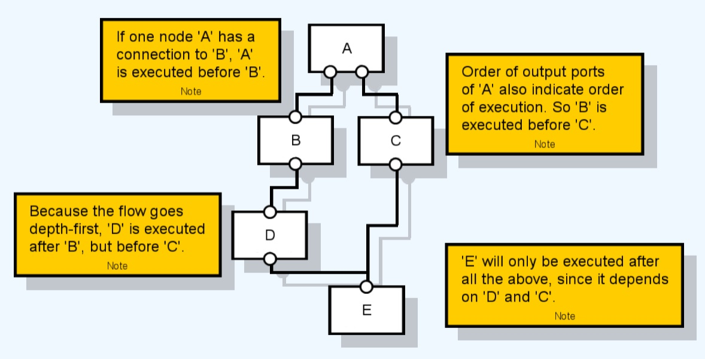
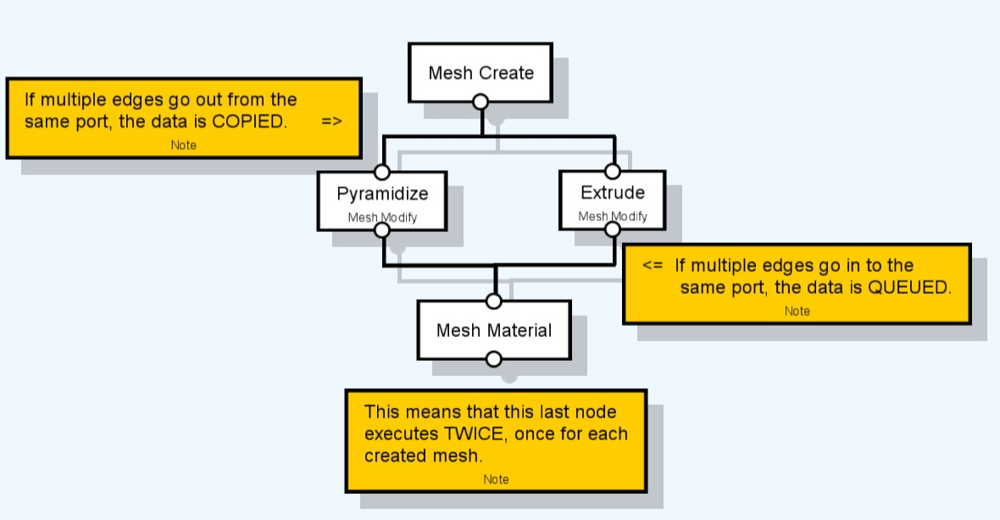
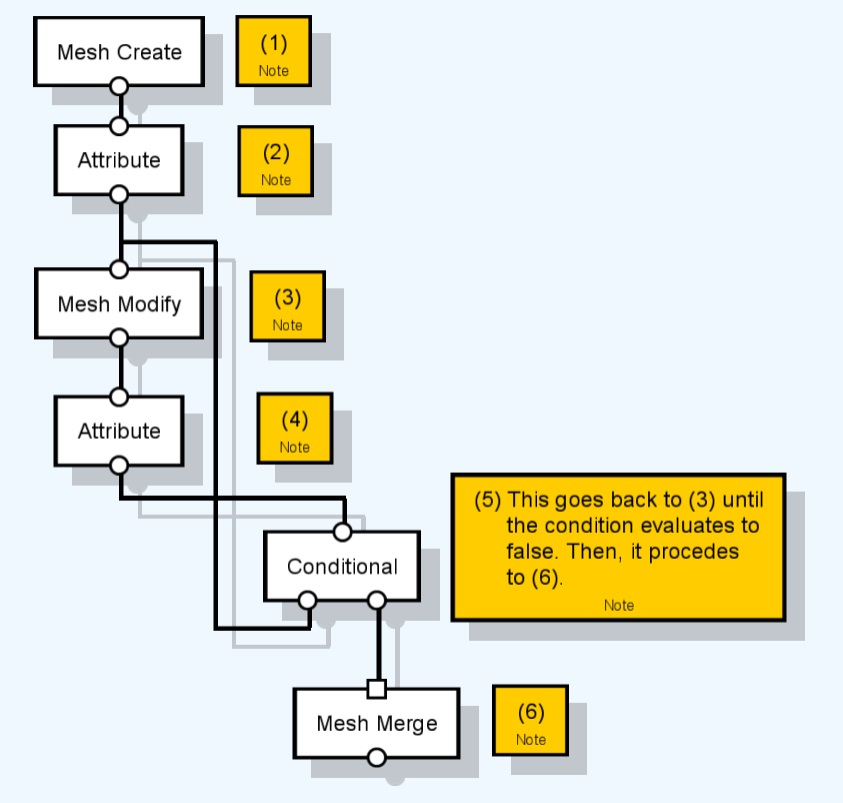

# Flow

In Sceelix’s Graphs, the order of execution of the nodes is dictated by the way that the entity data flows between them.

A node can only be executed after it has data in its input ports. This means that the nodes that precede that node (the parent nodes) must be executed before it (the child node) can. This goes on until the process reaches nodes without predecessors – the source nodes. If there is more than one source node in the graph, they will be executed without any particular order.

If a node has several children nodes, they will be executed according to their connections to the parent output order, from left to right, whereas the children of the first child will also be executed even before the second child. The following figure illustrates this idea:

In the graph editor, if you choose the option at the top menu->Graph->Execute (Step by Step), you can observe the order of execution of the graph nodes.

Understanding the logic of node execution order is usually not very important, since it follows the standard logic of flow diagrams that comes naturally. If you controlling references (coming soon), then managing order becomes more relevant.

## Parallelization

In most cases, the execution of a branch of nodes is independent from one another, since they are handling different entities. Because of this, a frequent question is why does not happen in parallel, rather than in sequence, and why doesn’t a node process its data once it arrives.

In Sceelix, nodes are executed as late as possible, so as to make sure that all their dependencies have been executed first. When it is their turn, they will handle their input queues, depending on the [nature of input port](Ports#inputs-natures). The ideia for collective inputs is that they should wait to collect as much data as possible, before they execute. If, in the above figure, node ‘E’ would be a node with a collective input for merging, for instance, meshes, then it should try to wait for all the meshes it is expected to get before actually doing the merge.

Another reason for sequencing is the need for order, when handling references of objects. This will be explained further ahead.

## Convergence and Divergence

Although one edge can only make one connection between an input and an output port, ports can actually have several incoming or outgoing edges, as long as they are connected to different ports.

* When an output port features many outgoing ports, there's data `divergence`. In these cases, the output entities are copied to each destination input. Note that the above rule of children node order does not apply, since there is no left and right. So there’s no guaranteed order of the children.

* When an input features many incoming ports, there's data `convergence`. In these cases, the input data is queued, also without any guaranteed order.

## Handling Loops

Very often, there is the need to go over several elements of a list, to execute a node several times or even repeat a couple of actions until a certain condition is met. In order to make this possible, you can connect an output port back to an input port of a parent node, creating a loop.

In practice, the rules for ordering and execution are the same. The only difference is that the sequence of nodes inside that loop will be repeated as many times as the data is sent back. Only then will the nodes after the loop follow their usual course. The figure below demonstrates the process.

