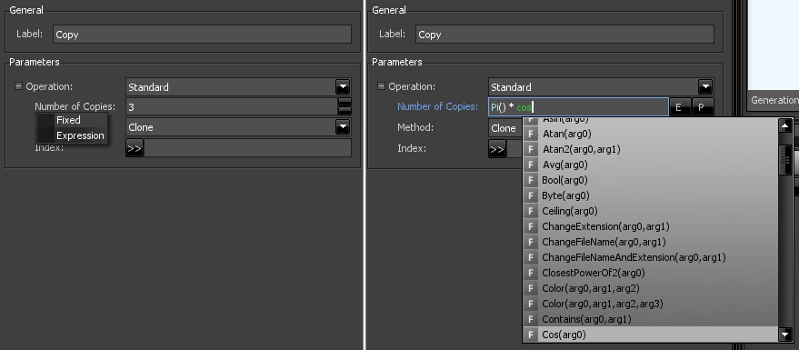
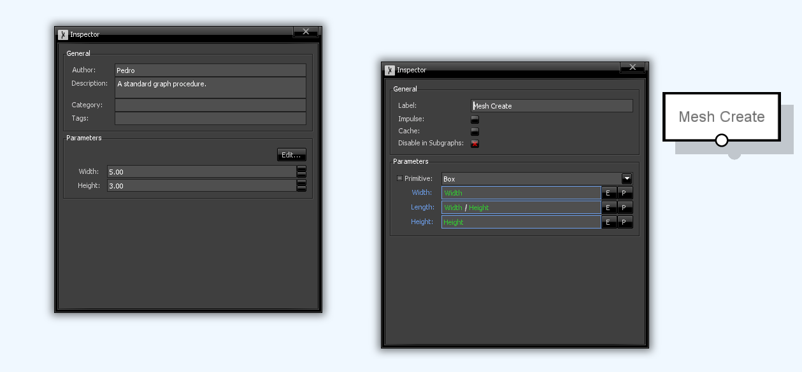

# Parameters

Parameters are the means to control what a node does with (or without) their input entities. They are accessible in the inspector window when a node is selected.

## Types

There are parameters of several _types_ such as integers, strings, floating-point, file paths, vectors, lists, etc. These are commonly found in most programming languages:

 * **Int**: A integer number.
 * **Bool**: A boolean value - either _true_ or _false_.
 * **Float**: A floating-point number, with a maximum of 6 decimal case precision.
 * **Double**: A float-point number, with a maximum of 15 decimal case precision.
 * **String**: A textual value, consisting of a string of characters.
 * **List**: A composition of any of the basic types above, or of other lists. A list can hold items of the same type (like [1,4,6]) or several types (like [45,"Hello",true,10.0]). Lists can be associative, meaning that each list item has a key (like ["Name" : "John", "Age" : 20, "Married", false]).
 * **Object**: A C# object that contains any of the above types or other objects. Sceelix's native libraries include the following object types:
   * **Vector2**: An object with float fields X,Y for positioning and direction calculation in 2D space.
   * **Vector3**: An object with float fields X,Y,Z for positioning and direction calculation in 3D space.
   * **Color**: An object with byte fields R,G,B,A (all integers in the 0-255 range) that describes a RGB color with Alpha/transparency component.
 * **Attribute Key**: A special type object that is used to store attribute references.

## Editors

For the same type of parameters, there are sometimes more than one available _editor_. For example, both a textbox and a multi-choice selection box could be used to write text strings.

These are the available _controls_ that work on the available types:

 * **Int**: A numeric spin control for introducing integer values. Produces values of type **Int**.
 * **Bool**: A checkbox control to indicate true (checked) or false (unchecked). Produces values of type **Bool**.
 * **Float**: A numeric spin control that accepts floating-point numbers. Produces values of type **Float**.
 * **Double**: A numeric spin control that accepts double-precision numbers. Produces values of type **Double**.
 * **String**: A text box that allows any text to be written. Produces values of type **String**.
 * **Choice**: A dropdown control that provides a limited choice of text items. Produces values of type **String**.
 * **File**: A text box with a file chooser tool for selecting project or system file paths. Produces values of type **String**.
 * **Folder**: A text box with a file chooser tool for selecting project or system folder paths. Produces values of type **String**.
 * **Attribute**: A text box that allows attribute names to be written. Produces values of type **Attribute Key**.
 * **Color**: A color picker for choosing colors from a palette. Produces values of type **Color**.
 * **Vector2D**: A set of two numeric spinners for writing 2D coordinates. Produces values of type **Vector2D**.
 * **Vector3D**: A set of three numeric spinners for writing 3D coordinates. Produces values of type **Vector3D**.
 * **List**: A control that allows the addition of a flexible number of items. Produces values of type **List**.
 * **Object**: A generic control, which can only be used in [expression mode](#expressions). Produces values of the indicated expression type. 
 * **Optional**: A checkbox control that toggles access to subcontrols. Produces values of type **List**.
 * **Select**: An dropdown control that provides access groups of subcontrols. Produces values of type **List**.
 * **compound**: A group of controls of any other type, including other compounds. Produces values of type **Object**.

## Expressions

Parameters can be assigned fixed values but also mathematical _expressions_. Click on a parameter label to change the control to 'Expression'.

You can use math functions and arithmetic operations. A popup window (which will appear when you start writing or by pressing Ctrl + Space) will list existing functions.

For longer expressions, or if you want a better overview over what functions and variables can be used, you can click the 'E' button on the right side of the expression text box that will open the advanced expression window, as illustrated below:

It is important to match the type of value to the parameter type. Still, if you write in a string and the type is float, the value will be converted automatically.

## Graph Parameters

You can also define graph parameters and reference them inside parameter expressions.

You can access them on the Graph Properties inspector by left-clicking anywhere on the back graph canvas, which will display them in the inspector window. Alternatively, the right-click context menu or the top menu (Graph->Properties) will lead you to the same place.

Parameters are _immutable_, meaning that they cannot be changed throughout the graph. They work as *constants* that can work as a single point of definition. If you are reusing the same value in several nodes, you could define a graph parameter and reference it in as many node parameters as you want. This way, you could change the actual value in a single location and all its references would be updated.

When a node parameter is in expression mode, a button with a "P" sign becomes available. This allows the quick creation of a new graph parameter, as shown below. By default, the popup window that appears will suggest one with the same (or similar) name, type and default value, but you could change these. When accepted, a reference to the parameter will be added to the expression textbox.

At any time, you can add, edit and delete parameters directly in the Graph Properties inspector, by clicking "Edit", as shown below. The "Edit Parameters" window lists all defined graph parameters in a tree. New ones can be added by right-clicking the "Parameters" item, and existing ones can be deleted my right-clicking them and choosing the respective option. 

Selecting a parameter will show its properties on the right side. Different parameter types have different available options (for instance, int, float and double parameters have minimum and maximum limits that can be set), but some common ones include:
* **Label**: The name of the parameter, as it appears in the Graph Properties inspector window. This can be changed at any time and Sceelix will update all references to the parameter inside the graph.
* **Identifier**: The way the parameter can be referenced to. This is generated automatically based on the label. For most cases, this should be the same as the Label, except if it uses spaces or special characters, which could conflict with the syntax of expressions.
* **Description**: A description of the parameter, which will appear on a tooltip when the parameter is hovered.
* **Section**: Defines a group, which helps separate and organize parameters visually on the Graph Properties inspector.
* **Public**: Indicates if the parameter should be visible when used as an encapsulated node. For more information, see the encapsulation section.
* **Entity Evaluation**: Indicates whether this parameter value will be evaluated based on individual entity or subentity properties/attributes inside the procedure, as opposed to be evaluated on each procedure round.

