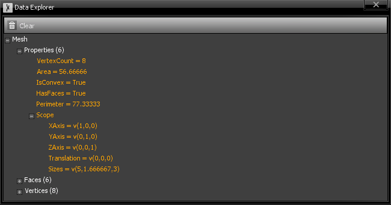
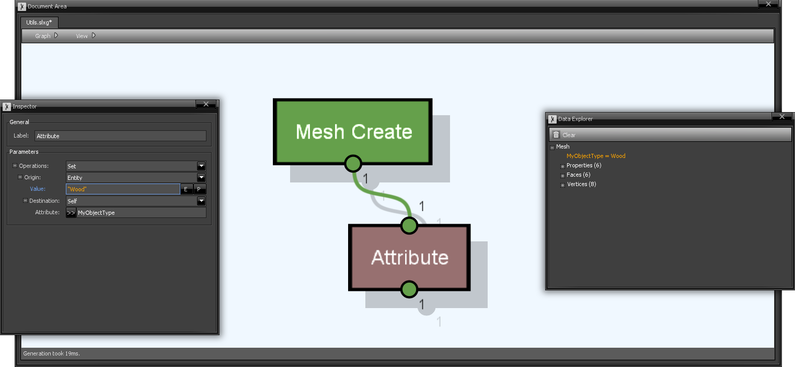
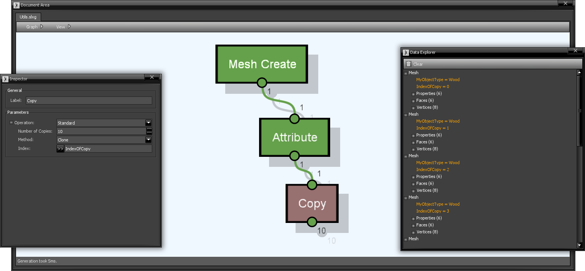
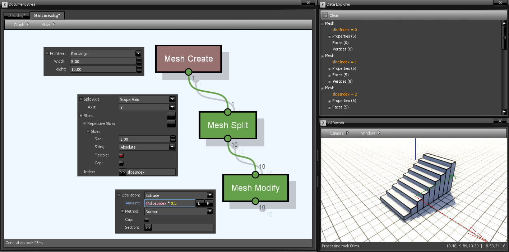

# Properties and Attributes

Entities area complex objects, featuring various properties. The color of a vertex, the scale or a surface or the position of a mesh are all examples of properties. While some of them are explicitly stored in the entity, others are the result of calculations - such as area, volume or number of vertices in a mesh - and hence are not stored unless requested. 

Different entities have different sets of properties, depending on their nature. Paths have length (the sum of all lengths of all edges), but no volume nor area, unlike meshes do.
 
A property does not need to be a number, it can be of other types as well - the same as those of [parameters](Parameters#types).

You can consult the list of available properties of a generated entity in the Data Explorer.

## Attributes

Users can assign custom properties to entities, which are called **attributes**. Attributes that have been assigned to an entity can be viewed on the Data Explorer as well. You can create new attributes using the [Attribute](../Nodes/Nodes/Basic/Sceelix-Core-Procedures-AttributeProcedure_b3ee6334-f7cb-435c-ab3b-3802fc835e0a) node. Here, you define what value to assign and what will be the name of the attribute.

Many other nodes can also create attributes. The [Copy](../Nodes/Nodes/Basic/Sceelix-Core-Procedures-CopyProcedure_50c9a7c0-6f52-470d-8bb7-2c8b663c94b8) node, which creates copies of entities, can save an index of the copy to an attribute, if you specify a name in the 'index' parameter. Likewise, the [Random](../Nodes/Nodes/Basic/Sceelix-Core-Procedures-RandomProcedure_92d65cb9-ef76-40fa-ad69-32707b893e36) node assigns its random generated values to attributes, and the [GIS Load](../Nodes/Nodes/GIS/Sceelix-Gis-Procedures-GisLoadProcedure_a7c10a2b-5554-4210-a0d9-36ad20fc8795) procedure can store metadata of each loaded geometry to an attribute. 

You can use attributes within expressions of parameters so as to achieve different transformations for each entity. In the example below, we are making use of the mesh split node's ability to assign the index of the splitted part to the mesh. We then use this value to extrude each mesh with a different value, creating a staircase.

