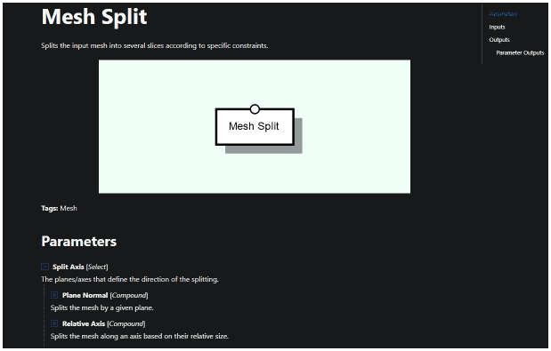

# Reference Structure

Since each node aggregates several different operations, their documentation is also structured in a particular way.

As mentioned before, nodes can have inputs, outputs and parameters. Parameters can have subparameters, some of which can be enumerated in lists or chosen from a limited set of options. Some inputs and outputs exist on the nodes, regardless of their configuration. However, some parameter value choices does indeed affect the number or type or inputs and outputs. For example, the “Mesh Subselect” creates a new output, which is the one through which the extracted mesh part will come though. The “Game Entity Create” node, on the other hand, can toggle the option to provide an input port to accept a mesh from which the game entity should be created.

In sum, there are a lot of possible options, hence each node documentation is structured as follows:

* **Image:** The typical look of the node when it is added to the graph (yet might change according to the parameter configuration).
* **Description:** A description of what the node does.
* **Parameter tree:** The enumeration of parameters of the node. Since parameters may have subparameters, these are organized in a tree-like structure whose leaves can be expanded or collapsed. Parameters that introduce new inputs or outputs are so identified, featuring a link to either one of the two sections.
* **Input list:** The list of inputs of the node, which can be empty. It features a subsection – parameter inputs – which features those ports that depend on certain parameter choices.
* **Output list:** The list of outputs of the node, which can be empty. It features a subsection – parameter outputs – which features those ports that depend on certain parameter choices.
