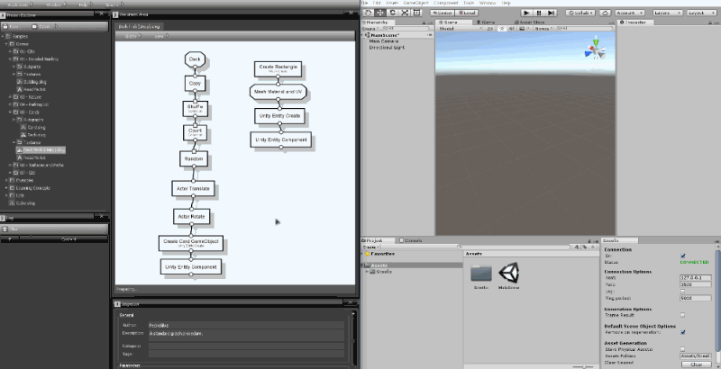

# Introduction to the Unity Plugin

Sceelix has the ability to communicate directly with the Unity Editor. This link allows data generated in the Sceelix Designer to be sent directly to an opened Unity Scene or to a prefab, instead of showing it in the 3D Viewer. This has the following advantages:

* It eliminates the need for tedious export-and-import to file processes, making the testing process much more efficient, consistent and error-free;
* It allows for resources that only exist in Unity to be instantiated, such as materials and prefabs;
* It allows any kind of data to be exported, including those for which no standard format exists, to be brought from Sceelix to Unity. This includes full Unity Game Objects and all kinds of behaviors/components!
* It can be adjusted and reprogrammed to invoke particular scripts on generation or/and to produce special kinds of assets, according to each project's needs.

In order for both software tools to communicate, a plugin must be installed within the target Unity project. Installation and workflow is explained in the next sections.

Unity is just the first tool of its kind to support this kind of unique integration. Support for further tools in planned for the future.