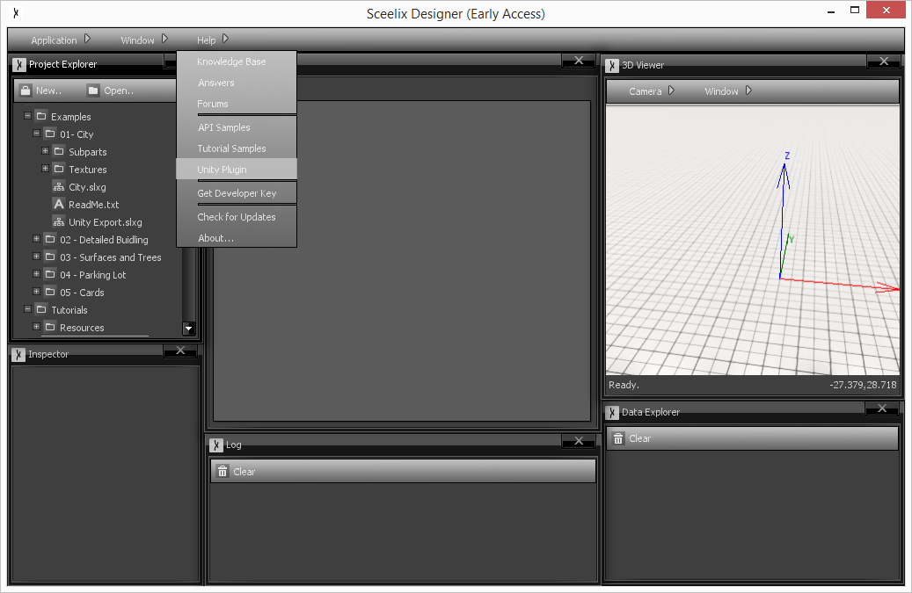
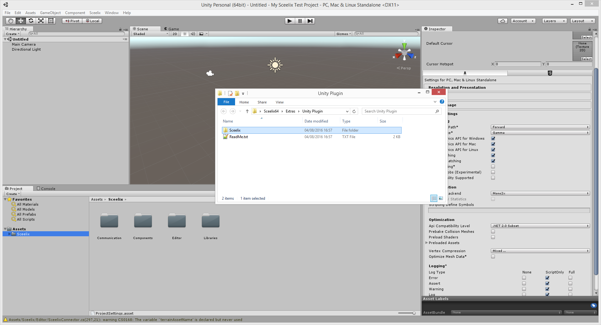

# Installing the Plugin

Open or create a new project in Unity. This should be configured as a 3D Project, because textures and assets need to be handled in a specific way.

Now, go to Sceelix Designer and, on the top menu, click Help -> Unity Plugin. If you are doing this for the same time, an quick extraction process will take place and the plugin folder will be shown to you.

Drag the `Sceelix` folder to the `Assets` folder of your Unity Project.

Assuming no build errors occur, a new entry in the top menu, under Tools->”Sceelix”, should appear. The plugin is now installed.

