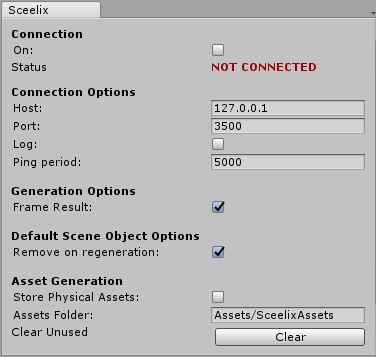

# Connecting the Editors

Once you have installed the plugin in your unity project, you can have it connect to Sceelix. Click the option in the top menu “Tools” -> “Sceelix”.

This will bring up a window with several options. Dock it somewhere on your layout. Unity requires this window to remain open in order for all its refresh and update functions to be called.

Let’s take it for a quick test. Toggle the first checkbox that says “On”. This will turn on the receptor on the unity side. If Sceelix is running, the connection will be established and the status will switch from “NOT CONNECTED” to “CONNECTED“.

Let’s go back to Sceelix and execute a graph. Open a graph and run it. In the example below, the sample graph “City.slxg” is being executed.

After a few seconds (depending on the size of the result) you should see a progress bar inside Unity, indicating that data is being processed. If everything goes well, the outcome of the graph should not only appear on the 3D Viewer, but inside Unity, too! No extra work needed!

### Behind the scenes

What’s happening here, exactly?

Basically the Sceelix plugin for Unity that you’ve installed allows Sceelix to communicate Unity directly via Sockets. So as long as Unity has its toggle button “On” switched on, Sceelix will send its data to Unity, which will interpret the Sceelix data, create Game Objects and add them to the current scene. These results are grouped under an empty parent object with the name of the executed graph.

## Exploring the options

Note that if you make a change to the graph and re-execute it, the new result will be sent to Unity again and will replace the previous result. If you would prefer to keep the result, you can do so by selecting the parent game object with the graph name, going to the inspector and disabling the checkbox called “Remove on Regeneration” under the “Sceelix Designer Component”. Doing so means that on the next graph regeneration, these objects will be kept.

If you would prefer every next graph results to be kept, you can change this in the plugin options window.

Let’s take a look at the other options:

* **Connection Options**
    * **Host:** The address of machine hosting Sceelix. 127.0.0.1 means that Sceelix is running on the same machine.
    * **Port:** The connection port to the Sceelix Designer. It should match the configuration set in the Sceelix Designer Settings -> Unity.
    * **Log:** If enabled, events and statuses of the connection will be logged to the Unity console.
    * **Ping Period:** The interval of time between server pings, so as to try to automatically connect.
* **Generation Options**
    * **Frame Result:** If enabled, the generated result will be zoomed in the 3D View.
* **Asset Generation**
    * **Store Physical Assets:** Indicates if, when transferring textures, materials and meshes, if these should be persisted to disk (will be stored under ‘SceelixAssets’). Doing this takes more time but may be useful in some cases. If disabled, these assets will only be stored in memory and directly in the project.
    * **Assets Folder:** Indicates where to store the physical assets (if the previous option is enabled).
    * **Clear Unused:** Removes all generated physical assets that are not being referenced in any scene.
 

**A note about the connection:** Unity is not very stable when using socket connections from within the editor, and it would crash when entering play mode or when compiling the project. To avoid such a behavior, the plugin will automatically turn off the connection during such occasions and then resume afterwards, as long as the “On” checkbox is enabled and according to the indicated “Ping Period”.