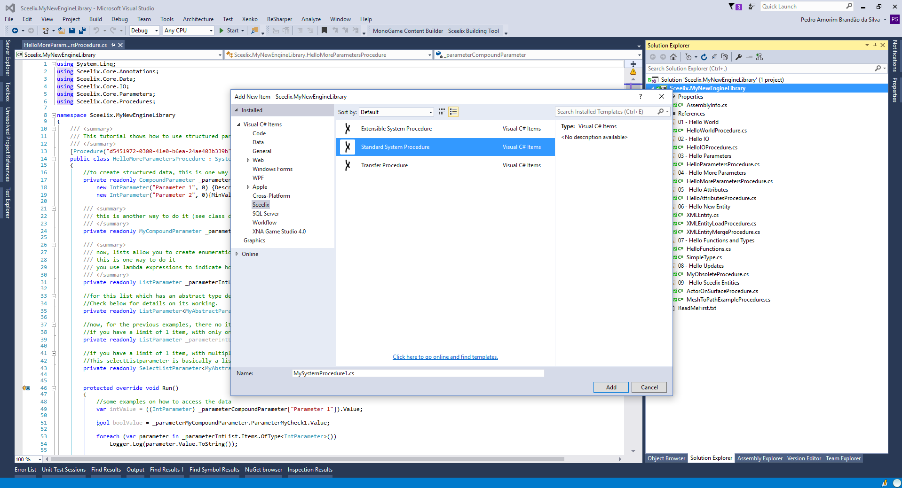

# The Sceelix SDK

One of the major design goals in Sceelix's development was to make it modular, extensible and accessible for all kinds of uses.

Making use of the power of the Mono/.NET Framework, Sceelix provides a development API, which allows the following: 

* **Engine Extensibility**: The Sceelix generation Engine, which provides the base framework for loading, managing and executing generation algorithms, can be extended with new procedures/algorithms, functions, data types, entities and other features. This brings not only new ways to manipulate the existing entities, but also to the possibility to create completely new types of content using the graph-based workflow.

* **External Application Use**: The Sceelix Generation Engine can be accessed outside the Sceelix Designer, by incorporating the libraries inside any Mono/.NET compatible application, service or game. Among other things, this could allow procedural generation workflows to be executed during runtime in a game or upon an event/request.

The programming language for development is C#, much like the language that Sceelix itself was developed.